# TicTicket-HCE-Android-App

為 TicTicket 專案的 App，主要功能及特色如下：

1. **以手機取代傳統票券，作為存放票券憑證的載體。**
1. **手機具感應驗證功能，可快速達成活動方驗證身分的目的。**
1. **系統具備錢包功能，可具有金流的加值與付款功能。**

利用 Google 在 2013 年底所發表的近端行動支付方案 (Host Card Emualtion)，

用手機能利用 NFC 功能完成感應付款，

透過代碼化 (Tokenization) 將安全元件的角色轉介給雲端，

同時也支援任何符合其他智慧卡(ISO 7816)規格相容的應用。

)

## 目錄

- [TicTicket-HCE-Android-App](#TicTicket-HCE-Android-App)
  * [目錄](#目錄)
  * [主要功能流程](#主要功能流程)
    + [操作及購票流程](#操作及購票流程)
    + [感應加值流程](#感應加值流程)
    + [驗票流程](#驗票流程)
  * [App 展示](#App-展示)
    + [用戶登入](#用戶登入)
    + [用戶註冊](#用戶註冊)
    + [感應加值](#感應加值)
    + [售票頁面](#售票頁面)
    + [線上購票](#線上購票)
    + [現場購票 (感應購票)](#現場購票%20(感應購票))
    + [持有票券及驗票](#持有票券及驗票)
    + [會員中心](#會員中心)
  
主要功能流程
---

### 操作及購票流程

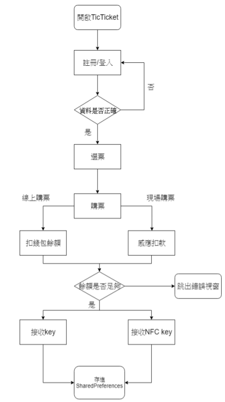

### 感應加值流程

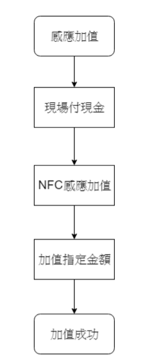

### 驗票流程

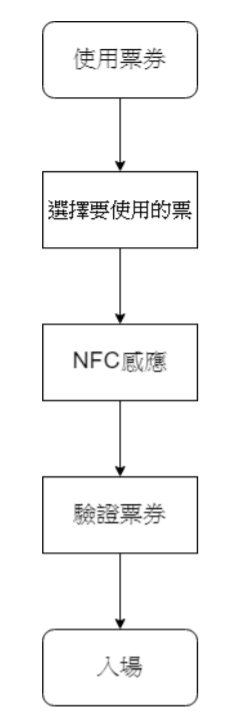

App 展示
---
### 用戶登入

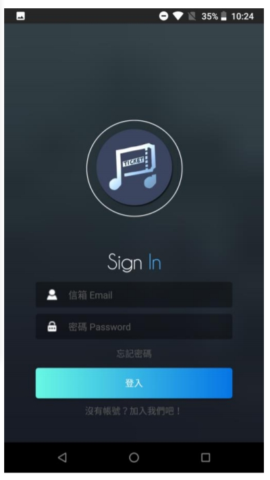

### 用戶註冊

### 感應加值

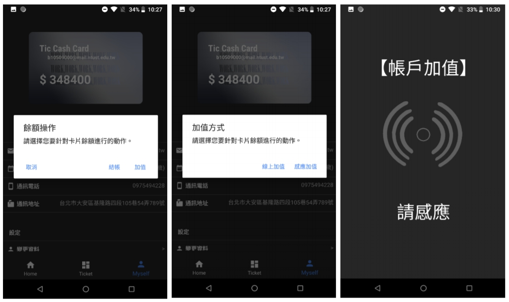

### 售票頁面

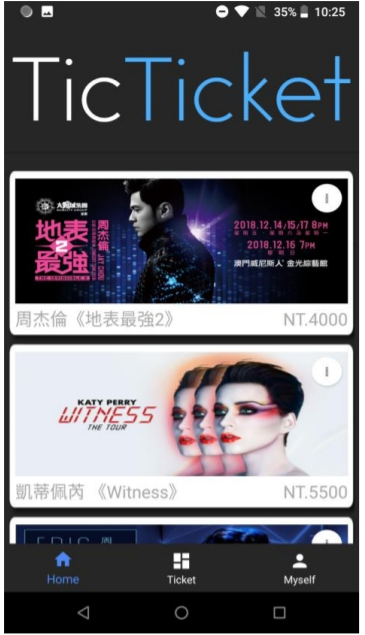

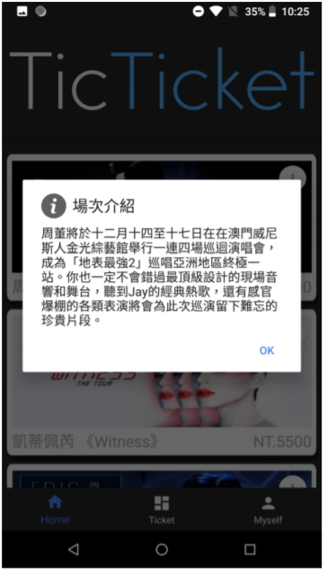

### 線上購票

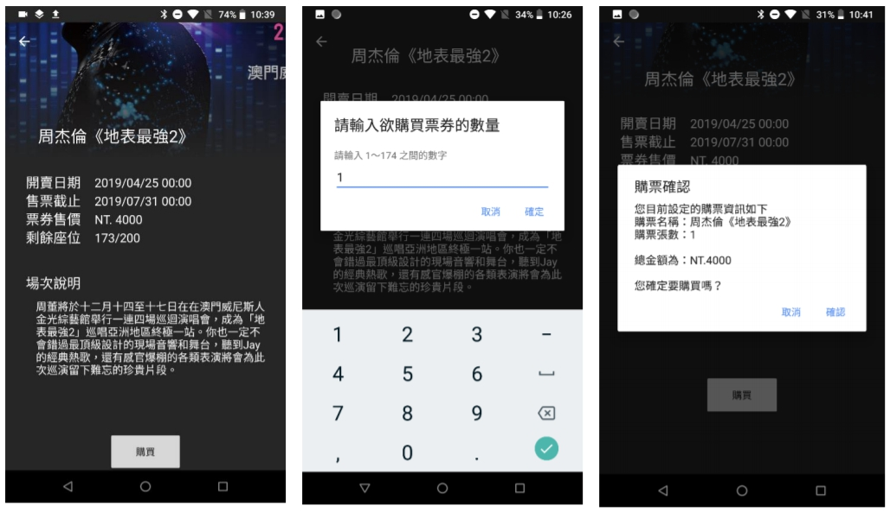

### 現場購票 (感應購票)

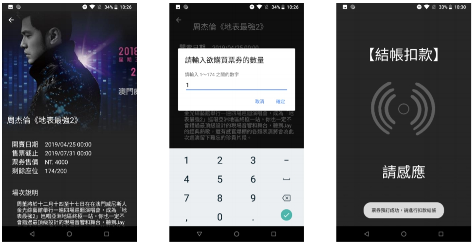

### 持有票券及驗票

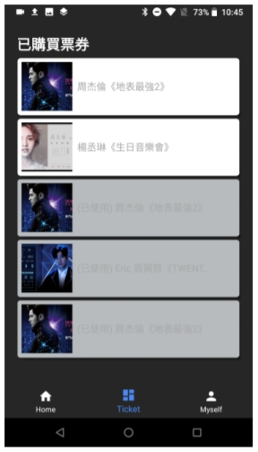

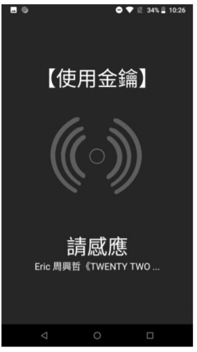

### 會員中心

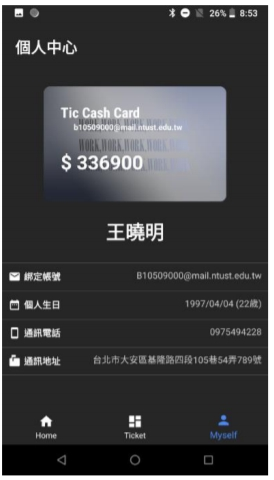

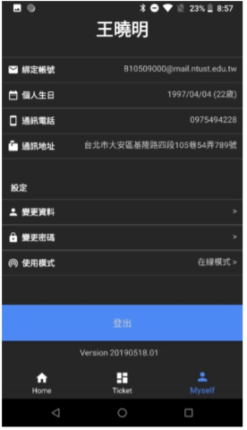

